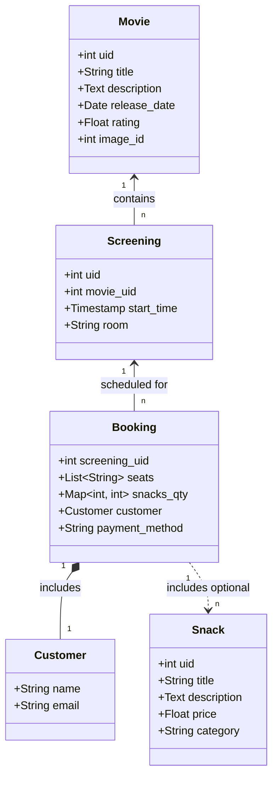

# Projektdokumentation: Super Kino

## 1. Allgemeine Projektbeschreibung
Das Backend bildet ein **TYPO3 (v12) CMS**, welches rein als Datenlieferant fungiert. Über selbst geschriebene PSR-15 Middlewares stellt es REST-Schnittstellen für Filme, Vorstellungen und Snacks bereit. 
Das Frontend ist eine **Next.js (React) Applikation**, die mit **Tailwind CSS v4** ein modernes und interaktives Design umsetzt. Die gesamte Plattform ist containerisiert (DDEV für das Backend, Node für das Frontend), was eine einfache Skalierbarkeit und lokale Entwicklung ermöglicht.

---

## 2. BSI-Grundschutz im Projekt

**Umgesetzte & Planbare Maßnahmen:**
- **Trennung von Frontend und Backend:** Durch die Trennung (Headless-Ansatz) wird die Angriffsfläche des Backends minimiert. Das TYPO3-Backend ist nicht direkt für Endkunden erreichbar oder sichtbar.
- **Sichere Kommunikation:** Die APIs sollten in Produktion ausschließlich über HTTPS/TLS kommunizieren.
- **Eingabeüberprüfung:** Das Next.js Frontend validiert Formulardaten (z.B. Formular-Felder, E-Mail-Format) vor dem Senden. Im TYPO3-Backend müssen Parameter durch Prepared Statements (Doctrine DBAL QueryBuilder ist im Einsatz) gegen SQL-Injection geschützt werden.

---

## 3. UML-Diagramm (Daten & Struktur)



---

## 4. API-Dokumentation

### `GET /api/movies` (TYPO3)
Ruft alle aktiven Filme ab.
- **Response `200 OK` (application/json):**
```json
[
  {
    "uid": 1,
    "title": "The Matrix",
    "description": "Ein Hacker entdeckt die wahre Natur der Realität...",
    "release_date": 922665600,
    "rating": 8.7,
    "image": 1
  }
]
```

### `GET /api/screenings` (TYPO3)
Ruft geplante Kinovorstellungen ab.
- **Response `200 OK` (application/json):**
```json
[
  {
    "uid": 1,
    "movie": 1,
    "start_time": 1730052000,
    "room": "Kino 1"
  }
]
```

### `GET /api/snacks` (TYPO3)
Ruft das Snack-Sortiment ab.
- **Response `200 OK` (application/json):**
```json
[
  {
    "uid": 1,
    "title": "Popcorn Groß",
    "description": "Süß oder Salzig",
    "price": 6.5,
    "category": "Food"
  }
]
```

### `POST /api/booking-success` (Next.js)
Nimmt eine neue Buchung entgegen.
- **Request Body (application/json):**
```json
{
  "screening": 1,
  "movie": "The Matrix",
  "seats": ["C4", "C5"],
  "snacks": { "1": 2 },
  "customer": { "name": "Max Mustermann", "email": "max@example.com", "payment": "card" }
}
```
- **Response `201 Created`:**
```json
{ "success": true, "message": "Booking recorded successfully", "data": {...} }
```

## 6. Datenbank-Einbindung
Die Datenbank (MariaDB/MySQL) wird exklusiv vom TYPO3-Backend verwaltet. Das Frontend besitzt keine eigene relationale Datenbank.

**Relevante Tabellen (Erstellt über `ext_tables.sql` der `cinema_api` Extension):**
- `tx_cinemaapi_domain_model_movie`: Speichert Filminformationen. Wichtige Spalten: `uid` (Primary Key), `title` , `description` , `image`.
- `tx_cinemaapi_domain_model_snack`: Kiosk-Angebot. Spalten: `uid`, `title`, `price` , `category`.
- `tx_cinemaapi_domain_model_screening`: Verknüpft Filme mit Zeiten. Spalten: `uid`, `movie`, `start_time`, `room`.

Die TYPO3-Middleware liest diese Tabellen mittels Doctrine DBAL aus:
```php
$queryBuilder->select('*')->from('tx_cinemaapi_domain_model_movie')->executeQuery()->fetchAllAssociative();
```

---

## 7. Unit Tests
Für Unit Tests im Frontend werden **jest** oder **Vitest**.

### 7.1 Test Beispiel : Preisberechnung

**Datei: `src/lib/priceCalculator.ts`**
```typescript
export function calculateTotal(ticketCount: number, ticketPrice: number, snacks: Record<number, {price: number, qty: number}>): number {
  const ticketsTotal = ticketCount * ticketPrice;
  const snacksTotal = Object.values(snacks).reduce((acc, item) => acc + (item.price * item.qty), 0);
  return ticketsTotal + snacksTotal;
}
```

**Datei: `src/lib/priceCalculator.test.ts`**
```typescript
import { calculateTotal } from './priceCalculator';

describe('Price Calculator', () => {
  it('correctly calculates total for tickets and snacks', () => {
    const snacks = {
      1: { price: 6.5, qty: 2 },
      2: { price: 3.5, qty: 1 }
    };
    // 2 tickets 15 + snacks 16.5 = 46.5
    expect(calculateTotal(2, 15, snacks)).toBe(46.5);
  });
});
```

### 7.2 Ausführung in der Konsole
1. Im Frontend-Ordner: `cd super_cinema_v2/frontend`
2. Installation: `npm install --save-dev jest @types/jest ts-jest`
3. Test-Lauf: `npx jest src/lib/priceCalculator.test.ts`

---

## 8. End-to-End Integrationstests

### 8.1 Test erstellen (Playwright)
**Datei: `tests/bookingFlow.spec.ts`**
```typescript
import { test, expect } from '@playwright/test';

test('User selects a movie and proceeds to checkout', async ({ page }) => {
  // 1. Gehe zur Startseite
  await page.goto('http://localhost:3000');
  
  // 2. Filme werden geladen (TYPO3 API Test)
  await expect(page.locator('text=Now Showing')).toBeVisible();
  
  // 3. Klicke auf  den ersten Film
  await page.locator('a.group.block').first().click();
  
  // 4. Klicke auf die Vorstellung
  await page.locator('a[href^="/book/"]').first().click();
  
  // 5. Wähle einen Sitzplatz und klicke weiter
  await expect(page.locator('text=SCREEN')).toBeVisible();
  await page.locator('button:has-text("A1")').click();
  await page.locator('button:has-text("Next Step")').click();
  
  // 6. Prüfe ob bei Snacks angekommen
  await expect(page.locator('text=Checkout')).toBeVisible();
});
```

### 8.2 Ausführung in der Konsole
1. In den Frontend-Ordner wechseln: `cd super_cinema_v2/frontend`
2. Installation: `npm init playwright@latest` (Standardfragen bestätigen)
3. Frontend und Backend starten (`npm run dev` in Next.js, `ddev start` in TYPO3).
4. E2E Test ausführen: `npx playwright test`
